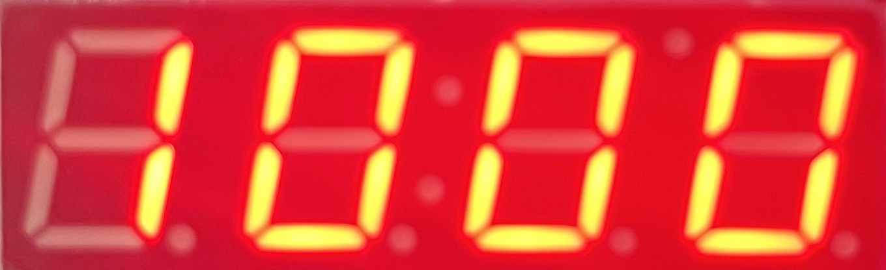

[# メモ

- [enPiT Shield 関係](#enPiT-Shield-関係)
- [Adafruit_LEDBackpack ライブラリ関係](#Adafruit_LEDBackpack-ライブラリ関係)

## enPiT Shield 関係

### LED の対応ピン

|LED0|LED1|LED2|LED3|
|---|---|---|---|
|D5|D6|D10|D11|

## Adafruit_LEDBackpack ライブラリ関係

[Adafruit_LEDBackpack](https://github.com/adafruit/Adafruit_LED_Backpack/)

### コンストラクタ

```cpp
Adafruit_7segment(void)
```

このページでは, 以下のようにインスタンスを生成する.

```cpp
Adafruit_7segment matrix = Adafruit_7segment();
```

### 基本

#### begin

`begin()` は初期化メソッドである.

```cpp
bool begin(uint8_t _addr, TwoWire *theWire)
```

使用例を以下に示す.

```cpp
matrix.begin(0x70);
```

#### writeDisplay

`writeDisplay()` はディスプレイに設定を反映するメソッドである.

```cpp
void writeDisplay(void)
```

使用例を以下に示す.

```cpp
matrix.writeDisplay();
```

#### clear

`clear()` はディスプレイの表示をクリアするメソッドである.

```cpp
void clear(void) 
```

使用例を以下に示す.

```cpp
matrix.clear();
```

>[!NOTE]
> 基本的なメソッドには他にも, `write()` や `blinkRate()` , `setBrightness()` , `setDisplayState()` 等が存在するがここでは省略する.

### 数値表示

#### print (数値 Ver.)

```cpp
void print(unsigned long n, int base = DEC)
void print(unsigned char b, int base = RAW_BITS)
void print(int n, int base = DEC)
void print(unsigned int n, int base = DEC)
void print(long n, int base = DEC)
void print(double n, int digits = 2)
```

使用例を以下に示す.

```cpp
matrix.print(1000)
matrix.writeDisplay();
```



基数の指定はしていないがデフォルトが `Decimal` であるため, `1000` が表示されている.

```cpp
matrix.print(-100)
matrix.writeDisplay();
```


符号付き整数も問題なく表示されている. なお, 数値表示では右寄せとなる.

```cpp
matrix.print(100, 16)
matrix.writeDisplay();
```


`100` の16進数表記が表示されている.

```cpp
matrix.print(1.2);
matrix.writeDisplay();
```


小数も問題なく表示されている. なお, 未指定の `digits` のデフォルト値は `2` であるため, 小数第2位まで表示されている.

```cpp
matrix.print(1.2, 3);
matrix.writeDisplay();
```


`digits` に `3` を指定しているため, 小数第3位まで表示されている.

> [!NOTE]
> print 系のメソッドには, 改行を含める `println()` や 実数を表示する `printNumber()` , 整数を表示する `printFloat()` が存在するがここでは省略する.

#### writeDigitNum

```cpp
void writeDigitNum(uint8_t x, uint8_t num, bool dot = false)
```

使用例を以下に示す.

```cpp
matrix.writeDigitNum(4, 1);
matrix.writeDisplay();
```


4番目のディスプレイに `1` が表示されている. なお, `dot` は指定していないが, デフォルトで `false` であるため表示されていない.

```cpp
matrix.writeDigitNum(4, 1, true);
matrix.writeDisplay();
```


`dot` に `true` を指定しているため, 点が表示されている.

```cpp
matrix.writeDigitNum(0, 10, false);
matrix.writeDisplay();
```


`writeDigitNum()` は, 引数として与えらえる数値によって処理が異なる.

|数値|処理|
|---|---|
|0-9|10進数表記で表示|
|10-15|16進数表記で表示|
|others|`return;`|

ゆえに, `10` を与えているため `a` が表示されている.

なお, 仕様上, 16進数表記は `a, b, c, d, e, f` ではなく, `a, B, C, d, E, F` である. なぜアルファベットの大・小文字が異なるのかは謎である.

### 文字列表示

#### print (文字列 Ver.)

```cpp
void print(const String &c)
void print(const char c[])
void print(char c)
```

使用例を以下に示す.

```cpp
matrix.print('A');
matrix.writeDisplay();
```


引数として与えた `'A'` が表示されている.

```cpp
matrix.print("abc");
matrix.writeDisplay();
```


引数として与えた `"abc"` が表示されている.

#### writeDigitAscii

```cpp
void writeDigitAscii(uint8_t x, uint8_t c, bool dot = false)
```

使用例を以下に示す.

```cpp
matrix.writeDigitAscii(0, 'A');
matrix.writeDisplay();
```


引数として与えた `'A'` が表示されている. なお, 未指定の `dot` は デフォルト値 `false` であるため点は表示されていない.

### その他

#### writeDigitRaw

```cpp
void writeDigitRaw(uint8_t x, uint8_t bitmask)
```

使用例を以下に示す.

```cpp
matrix.writeDigitRaw(0, 0b01110111);
matrix.writeDisplay();
```


ここで, 引数として与えている `0b01110111` は, 7セグメントで `'A'` を表示するためのものである. ゆえに, 0番目のディスプレイに `'A'` が表示されている.

#### drawColon / writeColon

```cpp
void drawColon(bool state)
void writeColon(void)
```

使用例を以下に示す.

```cpp
matrix.drawColon(true);
matrix.writeColon();
```


`:` のうち, 下側の点が表示されている.

#### printError

```cpp
void printError(void)
```

使用例を以下に示す.


エラー表記として `----` が表示されている.

### Unresolved

7セグメントで `12:00` のように時計を表示したい場合に, `:` を表示する必要があるが, 7セグメントディスプレイの `:` の部分に対する適切な値の設定方法がよく分からなかった. 取り敢えず, 以下の方法で期待通りの出力が得られたため良しとする.

```cpp
matrix.writeDigitNum(2, 2);
matrix.writeDisplay();
```


](https://github.com/adafruit/Adafruit_LED_Backpack/)
